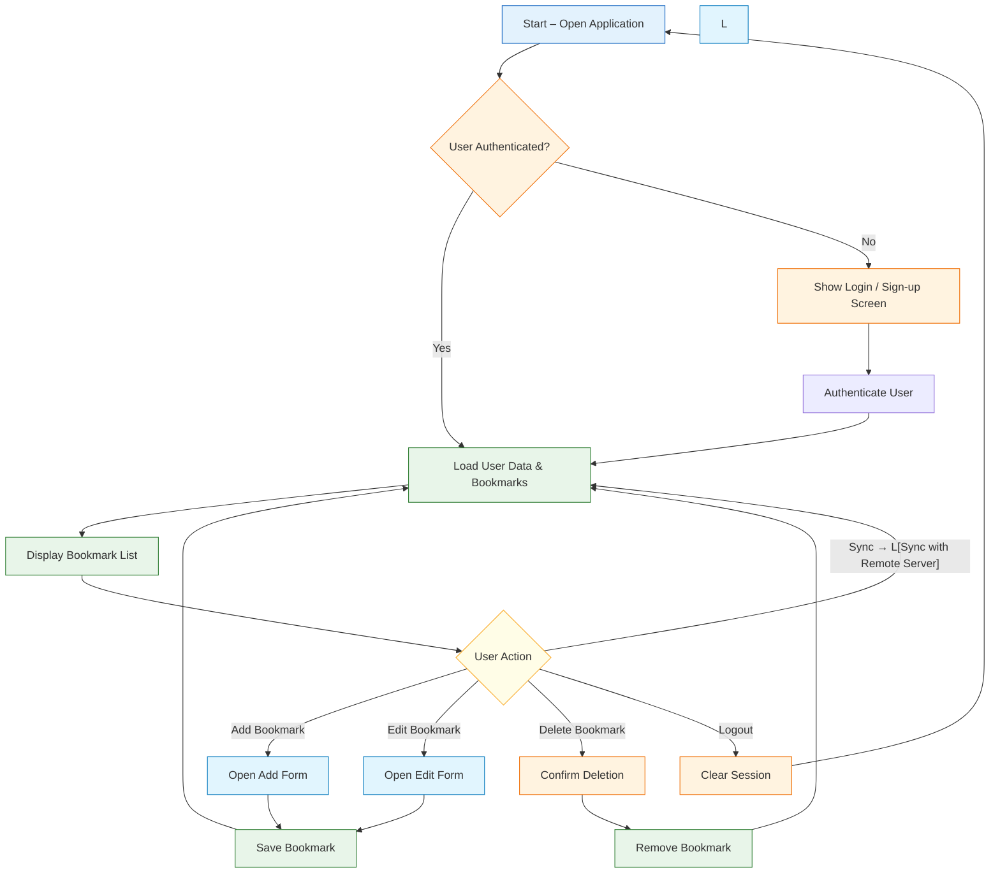

# MIN MARKERS - Technical Documentation

Version: **1.0.10**

## Executive Summary

MIN MARKERS provides a web‑based UI for live production operators to log time‑coded markers, supporting both free‑run mode and remote control via Bitfocus Companion. It can run as a Node.js development server or be packaged as a single Windows executable for on‑site deployment.

Key capabilities include:
- Real‑time marker creation and editing
- SSE‑based event broadcasting for Companion integration
- Export to CSV, FCP XML, and SRT formats
- Configurable framerate and free‑run start offsets

## Architecture & Tech Stack

**Application Flow**

- **Framework:** React 18 with Vite
- **Language:** TypeScript
- **Styling:** Tailwind CSS
- **Icons:** `lucide-react`
- **Animations:** `motion` (`motion/react`)

## Design Decisions

The application opts for a **lean front‑end** using native React state instead of external libraries (e.g., Redux) to keep bundle size minimal and reduce complexity for operators. Vite provides fast HMR during development, while **Tailwind CSS** ensures a consistent, utility‑first styling approach without heavy CSS frameworks.

**Server‑side**: A lightweight Express server handles SSE broadcasting and Companion webhooks, avoiding the overhead of a full‑featured WebSocket server while still providing real‑time notifications.

**Packaging**: `pkg` creates a single‑file Windows executable, bundling Node.js runtime and static assets for zero‑dependency deployment on production machines.

## State Management
At present, `MIN MARKERS` uses native React state (`useState`, `useRef`, `useCallback`, `useEffect`) to manage markers and a free‑run timecode mode without external state libraries.

### Core App State (`App.tsx`)

- **Markers:**
  - `markers`: Array containing `{ id, timecode, note, timestamp, color }`.
  - `activeNote`: The temporary string inside the main log entry input field.
  - `selectedColor`: Active color selected prior to saving a log (`accent`, `blue-500`, `purple-500`).
- **Mode Toggles:**
  - `timecodeMode`: Distinguishes between `free` (stand‑alone) mode.
  - `isFreeRunning`: Active state determining if local time generator is advancing.
  - `freeRunOffset`: Internal state to manage accumulated timecode delta.
  - `framerate`: Selected FPS (23.976, 24, 25, 29.97, 30, 50, 59.94, 60).
- **Editing State:**
  - `editingMarkerId`: ID of the marker currently being edited.
  - `editingNote`: Temporary buffer for the note being edited.
  - `editingTimecode`: Temporary buffer for the timecode being edited.
- **Companion SSE State:**
  - `companionConnected`: Boolean — `true` when the SSE connection to the server is alive.
  - `companionSseRef`: Ref holding the active `EventSource` instance.
  - `framerateRef` / `isFreeRunningRef`: Stable refs used inside SSE callbacks to avoid stale closures.

## Data Models

The primary data structures used throughout the application are:

- **Marker**: `{ id: string, timecode: string, note: string, timestamp: number, color: string }`
- **Export Formats**: CSV, FCP XML, SRT – each generated from the in‑memory Marker list.

Markers are stored in React state (no persistent database). Exporting persists them to files for later import.

---

## Backend — Express Server (`server.ts`)

### Optional TriCaster Proxy Endpoint
The server provides `/api/tricaster/status?ip=<address>` to query a TriCaster device for recording status and timecode. While the UI no longer exposes TC1 sync functionality, this endpoint remains for advanced integrations or legacy scripts.

---


### SSE Event Bus
- **Route:** `GET /api/events`
- **Mechanism:** The frontend opens a persistent SSE connection on app startup. The server maintains a list of active clients and broadcasts named events (`rec-start`, `rec-stop`) to all of them.
- A heartbeat comment (`: heartbeat`) is sent every 15 seconds to keep the connection alive through proxies and load balancers.
- On client disconnect, the client is removed from the list automatically.

### Bitfocus Companion Webhooks
Companion calls these endpoints via its **Generic HTTP** action:

| Method | Route | Description |
|--------|-------|-------------|
| `POST` / `GET` | `/api/companion/rec-start` | Broadcasts `rec-start` event to all SSE clients |
| `POST` / `GET` | `/api/companion/rec-stop`  | Broadcasts `rec-stop` event to all SSE clients  |

Optional body / query param for `rec-start`:
```json
{ "timecode": "01:00:00:00" }
```
If provided, the Free Run will start from that offset instead of `00:00:00:00`.

#### Companion → App flow
```
Companion (remote machine)
  │
  └─ POST /api/companion/rec-start
        │
        └─ Server broadcasts SSE event "rec-start"
              │
              └─ App.tsx EventSource listener:
                    - setTimecodeMode('free')
                    - setFreeRunOffset(timecode)
                    - setIsFreeRunning(true)
                    - setIsRecording(true)
```

### Validation checklist

1. Test Companion webhooks from any browser: `http://<machine-ip>:3000/api/companion/rec-start` → `{ "ok": true }`.
2. The **COMPANION** badge in the app header turns green when the SSE connection is established.
3. If Companion cannot reach the server from a remote machine, check Windows Firewall (port 3000).

---

## Timecode Logic


**Free Run Mode (`free`):**
A `setInterval` (~33 ms) runs locally inside `useEffect`. It captures `Date.now()`, compares against a start time + offset, and calculates total frames from elapsed time:
```javascript
const totalFrames = Math.floor((elapsed / 1000) * framerate);
```

**Companion-triggered Free Run:**
When a `rec-start` SSE event is received, the app immediately:
1. Switches `timecodeMode` to `'free'`
2. Sets `freeRunOffset` from the provided (or default) timecode
3. Sets `freeRunStartTime` to `Date.now()`
4. Sets `isFreeRunning` to `true`

No user interaction is required.

---

## Export Functionality
1. **CSV Export:** Outputs a simplified structure utilizing comma-separated column mapping (`Marker Name`, `Description`, `In`, `Out`). Supported effectively across Premiere Pro.
2. **FCP XML Export:** Implements simplified XML templating (`<xmeml version="4">`) with dynamic `<rate>` and `<timebase>` depending on the selected framerate.
3. **SRT Export:** Generates SubRip subtitle formatted text. It converts frames to milliseconds for standard `HH:MM:SS,ms` compliance.

---

## Build & Distribution

### Development
```bash
npm run dev     # starts tsx server.ts + Vite HMR
```

### Production binary (Windows)
```bash
npm run build:pkg
```
This runs: `vite build` → `tsc -p tsconfig.pkg.json` → `pkg build/server.js --targets node18-win-x64 --output min-markers.exe`

The resulting `min-markers.exe` embeds Node.js runtime + all `dist/` assets. **Only this single file** needs to be distributed to the target machine.

In production mode, the server resolves `dist/` relative to the `.exe` location using:
```typescript
const baseDir = (process as any).pkg ? path.dirname(process.execPath) : process.cwd();
```

---

## Future Developments & Roadmap

1. **Backend Real-Time WebSocket API**
   Polling currently happens at `500ms` intervals.
   - **Action:** Migrate to WebSockets for sub-frame accuracy when linking with advanced systems/equipment.

2. **Persistent Storage (Local or Cloud)**
   - **Action:** Implement `localStorage` caching or an IndexedDB wrapper so that a browser refresh does not destroy the active marker session.
   - **Action:** Add Firebase or Supabase configurations to synchronize team outputs globally across an instance.

3. **Advanced Hotkey Listener Management**
   - **Action:** Leverage custom window event hooks or a library like `react-hotkeys-hook` to expand bindings (Command/Ctrl sequences), prevent conflict with browser tools, and simplify cross-OS interaction.

4. **Multi-Track Markers**
   - **Action:** Support multiple marker tracks (e.g., separate tracks for Audio, Video, Directing notes) that can be toggled or exported independently.


