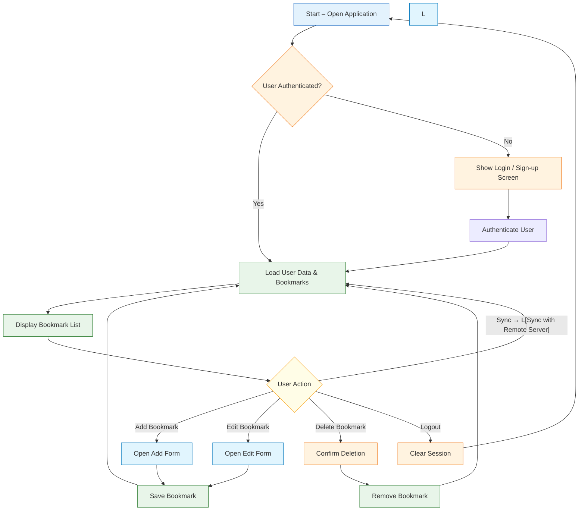

# MIN MARKERS - Documentation Technique

Version : **1.0.10**

## Résumé Exécutif

MIN MARKERS offre une interface web pour les opérateurs de production en direct afin d’enregistrer des marqueurs horodatés, avec prise en charge du mode libre et du contrôle à distance via Bitfocus Companion. L’application peut être exécutée en tant que serveur de développement Node.js ou empaquetée en un seul exécutable Windows..

Fonctionnalités clés :
- Création et édition de marqueurs en temps réel
- Diffusion d’événements via SSE pour l’intégration de Bitfocus Companion
- Exportation aux formats CSV, FCP XML et SRT
- Fréquence d’images configurable et décalage de démarrage du mode libre

## Architecture & Stack Technique

**Flux de l’application**

- **Framework** : React 18 avec Vite
- **Langage** : TypeScript
- **Styling** : Tailwind CSS
- **Icônes** : `lucide-react`
- **Animations** : `motion` (`motion/react`)

## Décisions de Conception

L’application privilégie un **front‑end léger** en utilisant l’état natif de React plutôt que des bibliothèques externes (ex. Redux) afin de garder une taille de bundle minimale et de réduire la complexité pour les opérateurs. Vite assure un HMR rapide en développement, et Tailwind CSS fournit une approche utilitaire‑first sans framework CSS lourd.

**Côté serveur** : un serveur Express léger gère la diffusion SSE et les webhooks Companion, évitant la surcharge d’un serveur WebSocket complet tout en offrant des notifications en temps réel.

**Packaging** : `pkg` crée un exécutable Windows monolithique, incluant le runtime Node.js et les assets statiques pour un déploiement sans dépendances.

## Gestion de l’État

Actuellement, `MIN MARKERS` utilise l’état natif de React (`useState`, `useRef`, `useCallback`, `useEffect`) pour gérer les marqueurs et le mode libre, sans bibliothèque d’état externe.

### État principal de l’application (`App.tsx`)

- **Marqueurs** :
  - `markers` : tableau contenant `{ id, timecode, note, timestamp, color }`
  - `activeNote` : texte temporaire dans le champ de saisie
  - `selectedColor` : couleur active sélectionnée (`accent`, `blue-500`, `purple-500`)
- **Commutateurs de mode** :
  - `timecodeMode` : distinction entre `free` (mode autonome) et les futures extensions
  - `isFreeRunning` : état indiquant si le générateur de temps avance
  - `freeRunOffset` : décalage accumulé du timecode
  - `framerate` : fréquence d’images choisie (23.976, 24, 25, 29.97, 30, 50, 59.94, 60)
- **État d’édition** :
  - `editingMarkerId`, `editingNote`, `editingTimecode`
- **État SSE Companion** :
  - `companionConnected`, `companionSseRef`, `framerateRef` / `isFreeRunningRef`

## Modèles de Données

Les structures de données principales :
- **Marker** : `{ id: string, timecode: string, note: string, timestamp: number, color: string }`
- **Formats d’export** : CSV, FCP XML, SRT – générés à partir de la liste de marqueurs en mémoire.

Les marqueurs sont conservés dans l’état React (pas de base de données persistante). L’exportation les persiste sous forme de fichiers.

---

## Backend — Serveur Express (`server.ts`)

### Point de terminaison optionnel de proxy TriCaster
Le serveur expose `/api/tricaster/status?ip=<adresse>` pour interroger un appareil TriCaster et récupérer le statut d’enregistrement et le timecode. Bien que l’interface ne propose plus la synchronisation TC1, ce point de terminaison reste disponible pour des intégrations avancées ou des scripts hérités.

---

### Bus d’Événements SSE
- **Route** : `GET /api/events`
- **Mécanisme** : le front‑end ouvre une connexion SSE persistante au démarrage. Le serveur maintient une liste de clients actifs et diffuse les événements nommés (`rec-start`, `rec-stop`).
- Un commentaire d’« heartbeat » est envoyé toutes les 15 s pour garder la connexion vivante.

### Webhooks Bitfocus Companion
Companion invoque ces points de terminaison via l’action **HTTP générique** :

| Méthode | Route | Description |
|--------|-------|-------------|
| `POST` / `GET` | `/api/companion/rec-start` | Diffuse l’événement `rec-start` à tous les clients SSE |
| `POST` / `GET` | `/api/companion/rec-stop`  | Diffuse l’événement `rec-stop` à tous les clients SSE |

Corps ou paramètre de requête optionnel pour `rec-start` :
```json
{ "timecode": "01:00:00:00" }
```
Si fourni, le mode libre démarre à ce timecode.

#### Flux Companion → Application
```
Companion (machine distante)
   │
   └─ POST /api/companion/rec-start
         │
         └─ Le serveur diffuse l’événement SSE "rec-start"
               │
               └─ Listener EventSource dans App.tsx :
                     - setTimecodeMode('free')
                     - setFreeRunOffset(timecode)
                     - setIsFreeRunning(true)
                     - setIsRecording(true)
```

### Checklist de validation
1. Tester les webhooks Companion depuis un navigateur : `http://<ip‑machine>:3000/api/companion/rec-start` → `{ "ok": true }`.
2. L’icône **COMPANION** dans l’en‑tête devient verte quand la connexion SSE est établie.
3. Si Companion ne parvient pas à joindre le serveur, vérifier le pare‑feu Windows (port 3000).

---

## Logique du Timecode

**Mode libre (`free`)** :
Un `setInterval` (~33 ms) s’exécute dans un `useEffect` local, capture `Date.now()`, le compare au temps de départ + décalage, et calcule le nombre total de frames :
```javascript
const totalFrames = Math.floor((elapsed / 1000) * framerate);
```

**Mode libre déclenché par Companion** :
Lorsqu’un événement `rec-start` SSE est reçu :
1. `timecodeMode` passe à `'free'`
2. `freeRunOffset` est défini depuis le timecode fourni (ou par défaut)
3. `freeRunStartTime` est assigné à `Date.now()`
4. `isFreeRunning` passe à `true`

Aucune interaction utilisateur n’est requise.

---

## Fonctionnalités d’Exportation
1. **Export CSV** : crée un tableau simple avec les colonnes `Marker Name`, `Description`, `In`, `Out` – compatible avec Adobe Premiere Pro.
2. **Export FCP XML** : génère un modèle XML simplifié (`<xmeml version="4">`) avec un `<rate>` et `<timebase>` dynamiques selon la fréquence d’images.
3. **Export SRT** : produit un fichier SubRip, convertissant les frames en millisecondes pour le format `HH:MM:SS,ms`.

---

## Construction & Distribution

### Développement
```bash
npm run dev     # lance tsx server.ts + Vite HMR
```

### Binaire de production (Windows)
```bash
npm run build:pkg
```
Cela exécute : `vite build` → `tsc -p tsconfig.pkg.json` → `pkg build/server.js --targets node18-win-x64 --output min-markers.exe`

Le fichier `min-markers.exe` embed le runtime Node.js ainsi que les assets `dist/`. **Seul ce fichier unique** est nécessaire sur la machine cible.

En mode production, le serveur résout le répertoire `dist/` relatif à l’emplacement de l’exécutable :
```typescript
const baseDir = (process as any).pkg ? path.dirname(process.execPath) : process.cwd();
```

---

## Développements Futurs & Feuille de Route
1. **API WebSocket en temps réel** – remplacer le polling de 500 ms par des WebSockets pour une précision sous‑frame.
2. **Stockage persistant** – ajouter un cache `localStorage` ou une couche IndexedDB afin que la session ne disparaisse pas lors d’un rafraîchissement, éventuellement synchroniser via Firebase ou Supabase.
3. **Gestion avancée des raccourcis clavier** – utiliser `react-hotkeys-hook` ou équivalent pour étendre les bindings, éviter les conflits et simplifier le support multi‑OS.
4. **Marqueurs multi‑pistes** – permettre plusieurs pistes de marqueurs (audio, vidéo, notes de direction) avec export séparé.

---
