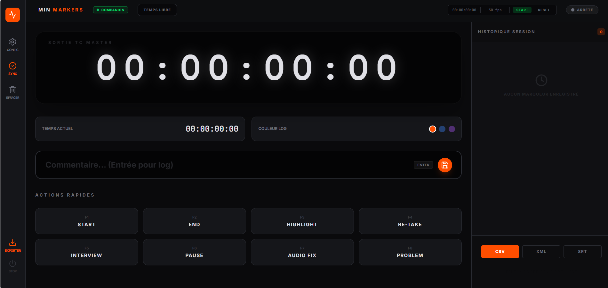
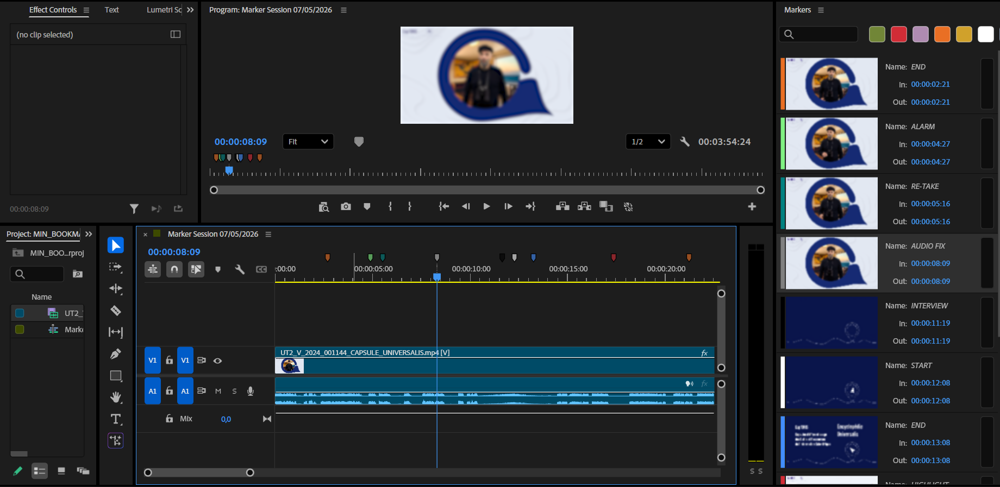
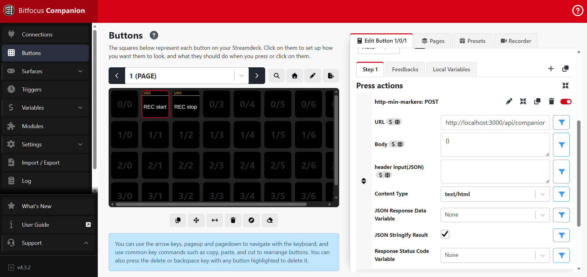

# MIN MARKERS (Bookmarks)

Version: **1.0.0**

MIN MARKERS is a lightweight local web application designed to create, manage and record bookmarks/markers for live production workflows. The goal of the app is to provide a simple, fast interface to log important moments, control timecode (Free Run), and integrate with automation tools so operators can quickly mark and recall events during live shows.

## Executive Summary

MIN MARKERS enables live production operators to capture and manage timecoded events in a web-based UI. It supports free‑run timecode, manual marker entry, and remote control via Bitfocus Companion. The application can run locally with Node.js or as a single‑file Windows executable, simplifying deployment on production machines without a development environment.

## Documentation Overview

- **Documentation** – explore the [DOCS folder](./DOCS) for detailed guides.

The following sections provide a comprehensive guide to the system architecture, design decisions, core components, deployment, and integration points. They are organized to serve multiple audiences:
- **Stakeholders & Architects**: High‑level overview and rationale.
- **Developers**: Detailed component descriptions, code examples, and contribution guidelines.
- **Operators**: Usage instructions and Companion integration.
- **Ops & Deployments**: Build process and executable packaging.

---

## Architecture Overview

A high‑level view of the system is captured in the **Technical Documentation** (see `DOCS/TECHNICAL_DOCUMENTATION_EN.md`). It outlines the front‑end built with React 18 + Vite, the lightweight Express server handling SSE and Companion webhooks, and the optional Windows‑only packaged binary.

## Further Documentation

- **Technical Documentation** – detailed architecture, design decisions, component internals: `DOCS/TECHNICAL_DOCUMENTATION_EN.md`
- **User Manual** – step‑by‑step operator guide and troubleshooting: `DOCS/USER_MANUAL_EN.md`

---


Key goals:
- Let operators create and organize markers/bookmarks for recordings and live events.
- Support Free Run timecode and manual marker entry for accurate logging.
- Integrate with Bitfocus Companion to remotely start/stop recording and automate marker workflows.
- Offer both a developer run mode (Node.js) and a distributable standalone Windows executable for machines without Node.js installed.

## IMPORT THEN YOUR MARKERS IN YOUR NLE
- export FCPXML file format from the app
- import FCPXML in your NLE and it will create a new sequence with your markers starting at 00:00:00:00.
- You can edit your markers in your NLE (Colors, comment) and find your highlights and comments for easier derush ad editing



## EXPORT YOUR MARKERS AS CSV TO SHARE WITH CLIENT
- export as a .csv format to share comments with your client or edit markers outside of your NLE for collab work
---

## Run Locally

**Prerequisites:**  Node.js

1. Install dependencies:
   ```
   npm install
   ```
2.  Run the app:
   ```
   npm run dev
   ```

---

## Build a standalone Windows executable (no web server required)

The application can be packaged as a single binary that runs on any Windows computer without needing Node.js or a separate web server.

**Prerequisites:**
- Node.js (only needed to run the build steps)

**Steps**
1. Install all dependencies (if not already done):
   ```
   npm ci
   ```
2. Build the binary:
   ```
   npm run build:pkg
   ```
   This command:
   - Compiles the front‑end with Vite (`dist/` folder).
   - Compiles `server.ts` to CommonJS (`build/server.js`).
   - Packages everything into `min-markers.exe` using `pkg`.
3. Distribute the generated `min-markers.exe` to the target machine.
4. Run the executable on the target computer:
   ```
   min-markers.exe
   ```
   The server starts on `http://localhost:3000`; open this URL in a browser to use the app.

**Note:** The binary includes the built assets, so no additional files or installations are required on the target machine.

---

## Bitfocus Companion Integration

MIN MARKERS can receive **Rec Start / Rec Stop** commands from [Bitfocus Companion](https://bitfocus.io/companion) running on any machine on the same network.  
When Companion triggers a recording, the app automatically switches to **Free Run** mode and starts the timecode — no polling of the source system is required.

### How it works

```
Companion  ──HTTP POST──►  /api/companion/rec-start  ──SSE──►  App (Free Run starts)
Companion  ──HTTP POST──►  /api/companion/rec-stop   ──SSE──►  App (Free Run pauses)
```

The app opens a persistent **SSE (Server-Sent Events)** connection to the server on startup.  
A green **COMPANION** badge in the top bar confirms the connection is active.

### Configure Companion

Find the IP of the machine running MIN MARKERS (e.g. `172.31.20.208`), then add a **Generic HTTP** action to your button:

| Button | Method | URL |
|--------|--------|-----|
| Rec Start | `POST` | `http://<machine-ip>:3000/api/companion/rec-start` |
| Rec Stop  | `POST` | `http://<machine-ip>:3000/api/companion/rec-stop`  |



Download and import this configuration file in your Bitfocus companion

(see `DOCS/exemple_config_http_companion.companionconfig')


> Both endpoints also accept `GET` requests for quick browser testing.

### Firewall (Windows)

**Server shutdown**: When the application runs as a packaged Windows executable, a **Shutdown** button appears in the UI (top‑right corner). Clicking it opens a confirmation modal; confirming sends a `POST /api/shutdown` request to the server, which gracefully exits after a short delay. This provides a clean way to stop the server without closing the console window.


If Companion cannot reach the server, open port 3000:
```powershell
netsh advfirewall firewall add rule name="MIN MARKERS" dir=in action=allow protocol=TCP localport=3000
```

---

**Prerequisites:**  Node.js

1. Install dependencies:
   `npm install`
2. Run
   `npm run dev`

APPLICATION REALISEE AVEC L'AIDE - ALBERT ETALAB: https://albert.sites.beta.gouv.fr/